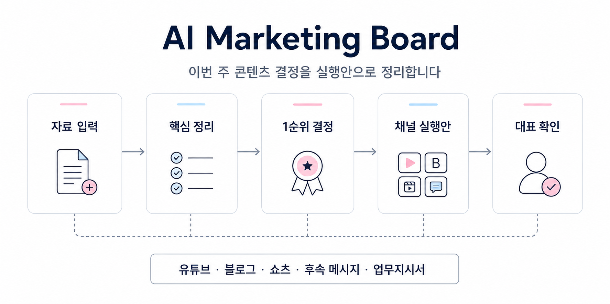

# AI Marketing Board

소상공인 대표가 매주 반복하는 콘텐츠 의사결정을 AI와 함께 정리하는 주간 마케팅 보드 템플릿입니다.

핵심은 간단합니다.

> 이번 주에 뭘 만들지 먼저 정하고, 그다음에 유튜브·블로그·쇼츠·후속 메시지로 나눕니다.

콘텐츠를 많이 뽑는 도구가 아닙니다. 대표가 바로 판단하고, 직원이나 외주에게 넘길 수 있는 실행안을 만드는 도구입니다.



이 흐름에서 중요한 부분은 가운데입니다. AI가 바로 글을 쓰는 것이 아니라, 고객 언어와 오퍼, 경쟁사, 과거 콘텐츠를 먼저 나눠 봅니다. 그다음 이번 주 1순위 콘텐츠를 하나만 고르고, 그 주제를 여러 채널로 확장합니다.

## 왜 필요한가

많은 대표님들이 콘텐츠를 못 만드는 이유는 글쓰기 실력이 부족해서가 아닙니다.

대부분은 아래 지점에서 막힙니다.

- 이번 주에 어떤 주제를 먼저 해야 할지 모르겠다
- 조회수는 나오는데 문의나 상담으로 이어지지 않는다
- 편집자나 외주에게 매번 설명하느라 시간이 든다
- 블로그, 쇼츠, 카카오 메시지가 따로 논다
- 발행 전에 조심해야 할 표현을 놓친다

AI Marketing Board는 이 문제를 **주간 회의**처럼 정리합니다.

## 전체 흐름

1. **자료 입력**

   사업 소개, 상품, 고객 발화, 과거 콘텐츠, 경쟁사, 브랜드 톤, 제작 제약을 적습니다.

   결과: AI가 볼 재료가 준비됩니다.

2. **입력 점검**

   정보가 충분한지, 부족한 부분은 무엇인지, 어떤 가정으로 진행할지 나눕니다.

   결과: 사실과 추측이 섞이지 않습니다.

3. **시장 판단**

   고객이 실제로 한 말, 전환 가능성, 경쟁사와 다른 점, 제작 가능성을 함께 봅니다.

   결과: 아무 주제가 아니라 팔릴 가능성이 있는 주제를 찾습니다.

4. **주제 선정**

   이번 주에 가장 먼저 만들 콘텐츠 1개를 고릅니다.

   결과: 대표가 고민해야 할 선택지가 줄어듭니다.

5. **채널 분배**

   같은 주제를 유튜브, 블로그, 쇼츠, 후속 메시지로 나눕니다.

   결과: 한 번 촬영한 내용을 여러 곳에 씁니다.

6. **대표 확인**

   과장 표현, 업종 리스크, 고객 사례 사용 여부를 확인합니다.

   결과: 발행 전 사고를 줄입니다.

7. **실행 정리**

   편집자, 블로그 외주, 숏폼 편집자에게 줄 지시를 정리합니다.

   결과: 바로 위임할 수 있는 업무지시서가 됩니다.

## AI가 보는 기준

AI에게 그냥 "콘텐츠 아이디어 줘"라고 하면 결과가 흔들립니다.

이 템플릿은 아래 기준으로 판단하게 만듭니다.

```text
고객이 실제로 한 말
  ↓
우리 상품과 연결되는가
  ↓
경쟁사와 다르게 말할 수 있는가
  ↓
이번 주에 실제로 만들 수 있는가
  ↓
문의, 상담, 신청으로 이어질 가능성이 있는가
  ↓
발행 전에 조심해야 할 표현은 없는가
```

그래서 결과물은 단순한 아이디어 목록이 아니라, 대표가 읽고 바로 결정할 수 있는 보고서에 가까워집니다.

## 빠른 시작

```bash
git clone https://github.com/unclejobs-ai/ai-marketing-board-public.git
cd ai-marketing-board-public
```

1. `START_HERE.md`를 읽습니다.
2. `templates/input-worksheet.md`를 복사해서 자기 사업 내용으로 채웁니다.
3. `templates/board-prompt.md`의 Lite Prompt를 AI 채팅에 붙여 넣습니다.
4. 나온 결과를 `examples/sample-ceo-report.md`와 비교합니다.
5. 발행 전에는 대표가 리스크와 승인 항목을 직접 확인합니다.

## 어떤 자료를 넣어야 하나

처음부터 완벽하게 쓸 필요는 없습니다. 아는 만큼만 적어도 됩니다.

```text
사업 소개
  어떤 사업인지, 주요 고객이 누구인지

이번 주 목표
  상담 신청, 문의 증가, 구매 전환 등 이번 주에 원하는 행동

상품 / 서비스
  무엇을 팔고, 고객이 어떤 변화를 기대하는지

고객이 실제로 한 말
  상담, 댓글, 후기, DM에서 나온 문장

과거 콘텐츠
  조회가 잘 나온 콘텐츠, 문의로 이어진 콘텐츠, 피하고 싶은 주제

경쟁사 관찰
  경쟁사가 자주 말하는 것, 우리가 다르게 말할 수 있는 것

브랜드 톤
  우리가 쓰는 말투, 피해야 할 말투, 금지 표현

제작 제약
  촬영 시간, 장비, 편집자/외주 유무

발행 전 확인
  고객 사례 사용 가능 여부, 가격/효과 표현, 업종상 조심할 표현
```

자세한 입력 항목은 `templates/input-worksheet.md`에 정리되어 있습니다.

## 결과물은 이렇게 나옵니다

AI에게 워크시트와 프롬프트를 넣으면 아래 내용을 받는 것을 목표로 합니다.

```text
1. 이번 주 1순위 콘텐츠
2. 왜 이 주제를 먼저 해야 하는지
3. 유튜브 / 블로그 / 쇼츠 / 후속 메시지 계획
4. 대표가 직접 말해야 하는 핵심 문장
5. 편집자와 외주에게 줄 업무지시
6. 발행 전 리스크 확인
7. 이번 주 실행 체크리스트
```

샘플은 `examples/sample-ceo-report.md`와 `examples/sample-delegation-brief.md`에서 볼 수 있습니다.

## 모델은 어떻게 나누면 좋나

처음에는 하나의 AI 채팅으로 시작해도 됩니다.

조금 더 정교하게 쓰고 싶다면 역할에 따라 모델을 나누면 좋습니다. 정확한 모델명은 서비스마다 계속 바뀌기 때문에, 아래처럼 **모델의 성격**으로 이해하면 됩니다.

1. **자료 정리: 빠르고 가벼운 모델**

   맡기기 좋은 일: 빠진 정보 찾기, 사실과 가정 나누기, 입력 자료 정리

   예시: Claude Haiku급, GPT mini급, Gemini Flash급

2. **고객·경쟁·오퍼 분석: 균형 잡힌 모델**

   맡기기 좋은 일: 고객 언어 분석, 경쟁사 빈틈 찾기, 오퍼와 전환 목표 연결

   예시: Claude Sonnet급, GPT flagship급, Gemini Pro급

3. **주제 선정과 채널 기획: 균형 잡힌 모델 또는 한 단계 강한 모델**

   맡기기 좋은 일: 이번 주 1순위 콘텐츠 선정, 유튜브·블로그·쇼츠 구조 만들기

   예시: Claude Sonnet급 이상, GPT flagship급, Gemini Pro급

4. **리스크 검수: 추론이 강한 모델**

   맡기기 좋은 일: 과장 표현, 법적 리스크, 고객 사례 사용 여부, 대표 승인 항목 확인

   예시: Claude Opus급, GPT reasoning급, Gemini Pro급

5. **대표 보고서 정리: 글 정리와 판단이 모두 좋은 모델**

   맡기기 좋은 일: 긴 분석을 대표가 10분 안에 읽을 수 있는 보고서로 압축

   예시: Claude Sonnet급 이상, GPT flagship급 이상, Gemini Pro급

운영 방식은 단순합니다.

```text
자료 정리 = 빠른 모델
분석과 기획 = 균형 잡힌 모델
리스크 검수와 최종 보고서 = 더 신중한 모델
```

모델 이름보다 중요한 것은 역할을 나누는 것입니다. 자료 정리는 가볍게, 콘텐츠 기획은 균형 있게, 리스크 검수와 최종 보고서는 더 신중하게 보는 방식이 좋습니다.

## 폴더 구조

```text
.
├── START_HERE.md                         처음 보는 사람용 10분 가이드
├── assets/
│   └── ai-marketing-board-flow.png       README용 워크플로우 이미지
├── templates/
│   ├── input-worksheet.md                사업 자료 정리용 워크시트
│   └── board-prompt.md                   AI 채팅에 넣는 Lite Prompt
├── examples/
│   ├── sample-ceo-report.md              대표 의사결정 보고서 예시
│   └── sample-delegation-brief.md        위임 업무지시서 예시
└── docs/
    ├── input-checklist.md                준비하면 좋은 입력 자료
    ├── demo-guide.md                     영상/데모 구성 흐름
    └── notes-for-creators.md             소개 콘텐츠 제작 메모
```

## 핵심 규칙

1. 고객이 실제로 한 말을 우선합니다.
2. 조회수보다 문의, 상담, 신청 같은 전환 가능성을 봅니다.
3. 하나의 콘텐츠를 여러 채널로 재활용합니다.
4. 효과 보장, 과장, 경쟁사 비방 표현은 피합니다.
5. 자동 발행하지 않고 대표 승인 후 발행합니다.
6. 정보가 부족하면 사실과 가정을 분리합니다.

## 더 깊게 운영하려면

이 저장소는 먼저 흐름을 익히기 위한 공개 템플릿입니다.

실제 운영에서는 업종별 자료, 고객 발화, 콘텐츠 성과, 리스크 기준이 더 촘촘할수록 결과가 좋아집니다. 더 풍부한 프롬프트 구성, 반복 운영 방식, Claude Code를 활용한 자동화 흐름은 Fronmpt Academy 강의 자료에서 이어서 다룹니다.

## 라이선스

MIT. 자유롭게 fork·수정해서 자기 사업에 맞게 바꿔 쓰셔도 됩니다.
